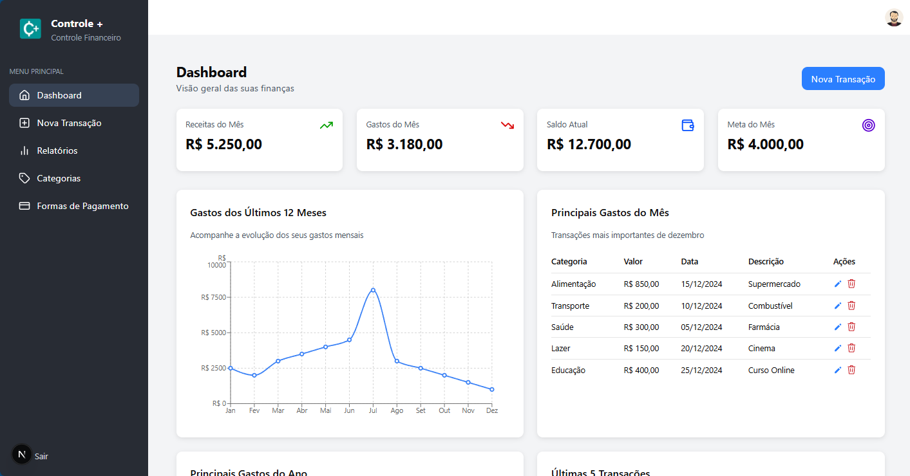
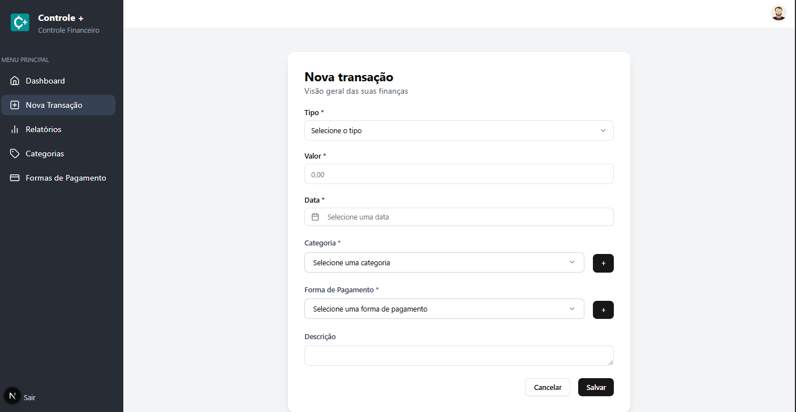
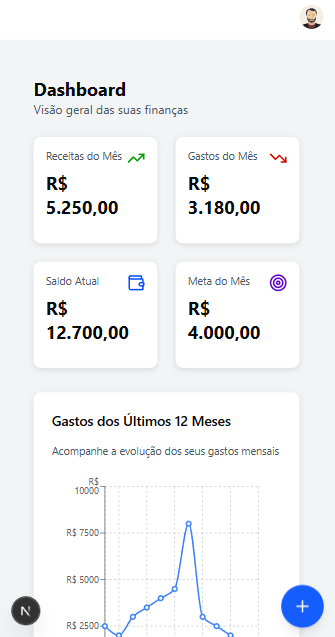
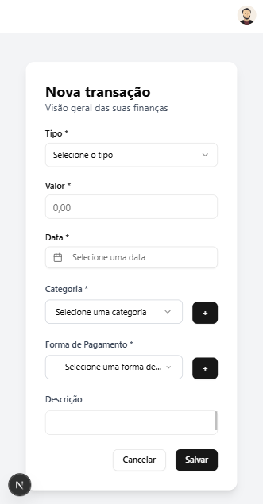

# Controle +

**Controle +** é uma aplicação de **controle financeiro pessoal** desenvolvido com **Next.js** e **Tailwind CSS**, com o objetivo de oferecer uma experiência moderna, intuitiva e responsiva para quem deseja organizar melhor suas finanças.

## 💡 Sobre o projeto

A ideia do **Controle +** surgiu da necessidade de ter um sistema simples, mas poderoso, para registrar entradas e saídas de dinheiro, acompanhar os principais gastos e visualizar gráficos de desempenho ao longo do ano. Ao invés de depender de planilhas complexas ou aplicativos genéricos, criamos uma solução pensada sob medida — com foco em usabilidade e clareza.

O projeto foi desenhado com atenção à interface e à experiência do usuário, com layout responsivo que se adapta tanto a desktops quanto a dispositivos móveis.

---

## 🔧 Tecnologias utilizadas

- **Next.js 14 (App Router)**
- **TypeScript**
- **Tailwind CSS**
- **Lucide Icons**
- **shadcn/ui**
- **TanStack Table** (futuramente para exibição de dados em tabelas)

---

## 🖥️ Funcionalidades já implementadas

- Sidebar com navegação principal
- Layout responsivo
- Botão flutuante (+) em telas menores para cadastrar nova transação
- Gráfico de gastos nos últimos 12 meses
- Tabela com principais gastos do mês e do ano
- Modal para adicionar categorias e formas de pagamento

---

## 📱 Layout Responsivo

### Versão desktop:


### Versão mobile:



---

## 🧪 Como rodar localmente

1. Clone o repositório:

```bash
git clone https://github.com/jhonux/controle-mais.git
cd controle-mais
